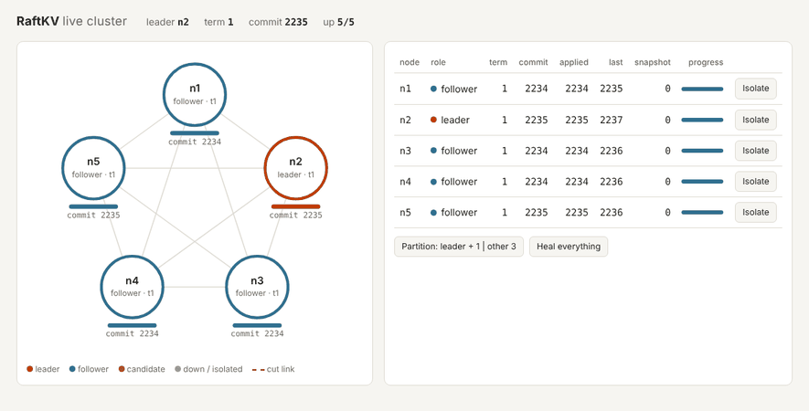
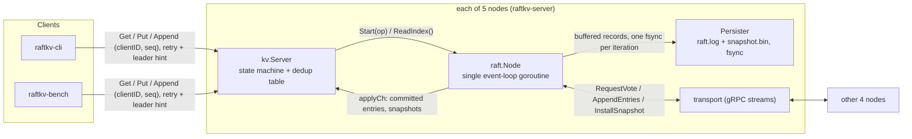

# RaftKV

A fault-tolerant, linearizable key-value store in Go, built on a from-scratch implementation of the Raft consensus algorithm and checked under partitions, crashes and message loss with the Porcupine linearizability checker.



## Results

Measured on a 2-vCPU cloud VM (Intel Xeon @ 2.1 GHz, 7 GiB RAM, Linux 6.18, Go 1.24), with all 5 server processes and the load generator on the same machine over loopback. Full protocol and raw data: [`benchmarks/results/summary.md`](benchmarks/results/summary.md).

| Metric | Result | Command |
|---|---|---|
| Throughput, 5-node cluster | **12,138 ops/s** median of 3 runs at 64 clients (8,407 at 32 clients) | `make bench` ([`benchmarks/run.sh`](benchmarks/run.sh)) |
| Client-observed latency at that point | **p99 11.3 ms**, p50 4.9 ms, p99.9 17.1 ms | same run |
| Linearizability under faults | **500 / 500** seeded chaos runs accepted by Porcupine, 996,744 operations checked, 0 failures (with `-race`) | `make chaos RUNS=500 DURATION=5s` |
| Losing the leader | `kill -9` of the leader: new leader in 0.42 s, then again in 0.56 s with 4 nodes left; the cluster kept serving on 3 of 5 | fault step of `benchmarks/run.sh` |

Workload: closed-loop clients, 50% Put / 50% Get, 64-byte values, 10,000 keys, 10 s warm-up then 60 s measured, 3 repeats on a fresh cluster each, median reported. Latency is from request sent to reply received, exact percentiles over every operation.

What each optimisation bought, adding one at a time (median ops/s, p99 ms in brackets):

| step | 1 client | 8 clients | 32 clients | 64 clients |
|---|---:|---:|---:|---:|
| baseline: 1 entry per AppendEntries, 1 in flight, fsync per update, Gets through the log | 797 (2.4) | 948 (14.4) | 937 (52.8) | 946 (98.3) |
| + batching | 793 (2.3) | 2,541 (6.2) | 4,300 (12.6) | 4,804 (21.7) |
| + pipelining (64 in flight) | 821 (2.2) | 2,748 (5.6) | 4,498 (11.9) | 4,870 (20.0) |
| + group commit | 814 (2.1) | 2,693 (6.2) | 7,269 (9.5) | 11,214 (12.0) |
| + ReadIndex reads | 1,178 (1.8) | 3,086 (5.6) | 7,716 (8.7) | 11,462 (11.4) |
| + leader sends before its own fsync | 1,273 (1.7) | 3,235 (5.4) | 8,407 (8.3) | 12,138 (11.3) |

Batching and group commit did almost all of the work; pipelining adds little on loopback, where a round trip is far cheaper than an fsync. Group commit only paid off after one more fix found by profiling: the KV server held its mutex across `raft.Start`, so proposals reached the Raft loop one at a time and the leader still did about one fsync per entry. Removing that lock (design decision 5 below) is included in every row above; in a short probe before and after it, 64 clients went from 3,760 to 10,475 ops/s.

This machine is CPU-bound (2 vCPUs for 6 processes, with fsync about 0.16 ms), so the numbers say more about relative gains than about what the code does on bigger hardware.

## Architecture



**`raft/`** is the consensus core. Each `raft.Node` runs one goroutine that owns all Raft state; messages, ticks, proposals, snapshot and read requests reach it through channels, so there are no locks inside the algorithm. Every loop iteration ends with `flush()`: make everything changed in that iteration durable with one fsync, then send the queued messages. The leader tracks each follower in probe, replicate or snapshot state, pipelines up to 64 AppendEntries per follower, and backs up a whole term at a time on conflicts. Committed entries go to an apply queue drained by a separate goroutine, so a slow state machine never delays heartbeats.

**`raft/persister.go`** stores the term, vote and log in an append-only file of CRC-framed records, and the latest snapshot in a second file. On startup it replays the log and cuts off a torn tail. Snapshots are installed atomically: write the snapshot to a temp file, fsync, rename, fsync the directory, then rewrite the log the same way.

**`kv/`** is the service. `Server` turns Put/Append into log entries and answers once they are applied; Gets use ReadIndex (or the log, if configured). `Store` is the deterministic state machine with the per-client dedup table that makes retries exactly-once. `Clerk` is the client: random 64-bit ID, increasing sequence numbers, leader hints, retries with backoff.

**`transport/`** is one interface with two implementations. `transport/sim` is an in-memory network with seeded drops, delays, reordering, partitions and crashes, used by every test. `transport/grpc` keeps one client stream per peer with its own bounded queue and sender goroutine, so sending never blocks the Raft loop. The `raft` package does not import gRPC.

**`chaos/`** runs 5-node clusters in-process on the simulated network, injects faults while 5 clients run, records every operation with its invocation and return time, and checks the history with Porcupine.

**`cmd/`** has the four binaries: `raftkv-server` (one node, plus `/status`, `/admin` and `/debug/pprof` over HTTP), `raftkv-cli`, `raftkv-bench` and `raftkv-dash` (the live view above, served from `web/`).

## Design decisions

1. **One event-loop goroutine per node instead of a mutex around Raft state.** The alternative (one lock, RPC handlers and timers as separate goroutines) is how most first Raft implementations are written and where most of their bugs live: holding the lock while sending an RPC, or acting on a reply after the state changed underneath. With one owner, every handler runs to completion against a consistent state, and "send" just appends to an outbox.

2. **One-way messages, not request/response RPCs.** The transport only offers `Send` and `Recv`; a reply is a separate message that may never arrive. That matches what Raft actually assumes about the network, lets the simulated network drop, delay and reorder replies independently of requests, and lets the gRPC transport use a single stream per peer.

3. **Group commit at the end of every loop iteration, instead of an fsync per state change.** The loop drains whatever is already waiting (up to 256 messages and proposals) before flushing, so one fsync covers all of it. The rejected alternative, syncing inside each handler, is simpler to reason about but costs one fsync per entry on every node. Replies leave only after the fsync, so nothing is acknowledged before it is durable.

4. **ReadIndex for Gets instead of putting reads in the log or using leases.** Log reads cost an fsync on a majority per read. Leader leases are cheaper still but are only safe if clock drift is bounded. ReadIndex costs one heartbeat round, which is batched across all reads that arrive together, and depends on no clocks.

5. **Waiters keyed by (clientID, seq), registered before `raft.Start`, instead of holding the server lock across `Start`.** The lock-based version (the usual way to avoid missing an apply that races with registration) serialised proposals, so the Raft loop saw one per iteration and neither batching nor group commit did anything. Keying by request also means a client gets its answer even when an earlier attempt, through another leader, is the one that committed.

6. **A hand-written binary record format instead of gob or protobuf for the log file.** Gob writes type information at the start of every stream, which doesn't fit a file of independent, individually checksummed records that must be readable after a torn write; protobuf would add a schema for data that never leaves the node. The format is a few dozen lines (`encoder`/`decoder` in `persister.go`) and every record is CRC-checked.

## How to run

Requires Go 1.22+. Docker is optional.

```sh
git clone https://github.com/shreyans-chowdry/raftkv && cd raftkv
make build                 # bin/raftkv-server, raftkv-cli, raftkv-bench, raftkv-dash
```

Tests:

```sh
make test                  # quick: short mode
make race                  # full suite with -race (what CI runs, a few minutes)
make chaos RUNS=500 DURATION=5s     # 500 seeded chaos runs (~11 min on 2 cores)
make chaos-replay SEED=137          # replay one seed verbosely
make lint                  # go vet + staticcheck
```

A 5-node cluster as local processes (no Docker), with the live view:

```sh
scripts/cluster.sh start           # nodes on 127.0.0.1:7001-7005, status on :8001-8005
bin/raftkv-cli put greeting hello
bin/raftkv-cli append greeting ", world"
bin/raftkv-cli get greeting        # hello, world
scripts/cluster.sh status
scripts/cluster.sh kill 3          # kill -9 one node; the rest keep serving
scripts/cluster.sh restart 3
bin/raftkv-dash                    # open http://localhost:9000
scripts/cluster.sh stop
```

The same with Docker:

```sh
make cluster                       # docker compose up --build -d (ports 7001-7005, 8001-8005)
bin/raftkv-cli get greeting
docker kill raftkv-n2-1 raftkv-n4-1   # any two can die
make cluster-stop
```

Acceptance run for the deployment milestone (writes 100 keys, kills the leader and then a second node, reads everything back, restarts both and checks they catch up):

```sh
scripts/acceptance.sh
```

Benchmarks (about 90 minutes for the full protocol; plug in and close other apps):

```sh
make bench                         # = benchmarks/run.sh; writes benchmarks/results/summary.md
WARMUP=5s DURATION=20s REPEATS=1 benchmarks/run.sh   # quick version
```

## Testing strategy

| Layer | What it proves | Where |
|---|---|---|
| Simulated network | Same seed and send sequence give the same drops and delivery order; partitions block both ways; crashes discard in-flight messages | `transport/sim/sim_test.go` |
| Unit tests with a manual clock and fake peers | Election timer bounds and reset rule; the Figure 8 commit rule; votes survive restarts | `raft/election_test.go`, `raft/replication_test.go`, `raft/persist_test.go` |
| Persister | Round trips, torn and corrupt tails recovered, crash between snapshot and log rewrite | `raft/persist_test.go` |
| Invariant checker on every test cluster | Election safety, leader completeness, commit agreement while running; log matching at the end | `raft/invariants.go` |
| Seeded scenario suites | 1,000 election runs under random partitions; 300 Figure 8 runs with crashes on a 20%-loss reordering network | `TestElectionSafetyManySeeds`, `TestCrashFigure8ManySeeds` |
| KV tests | Every append lands exactly once under loss, partitions, crashes and lost replies; logs stay bounded; InstallSnapshot catch-up; no stale read from a deposed leader | `kv/kv_test.go` |
| Real network | 3 nodes over gRPC survive losing the leader | `transport/grpc/grpc_test.go`, `scripts/acceptance.sh` |
| Chaos + Porcupine | Linearizability of whole client histories under combined faults | `chaos/` |

Each safety-critical rule was also checked by breaking it on purpose and confirming a test fails: dropping the Figure 8 term check (caught by `TestFigure8CommitRule`), replying before the fsync (caught by the seeded crash runs as a leader-completeness violation), and skipping ReadIndex's leadership confirmation (caught by `TestNoStaleReadFromDeposedLeader` and by chaos seeds 9 and 22).

## Correctness

The chaos harness (`chaos/`) starts 5 nodes in one process on the simulated network, with real persisters on temp directories. Five clients run against 5 keys so operations conflict; client 0 only reads, which is the client that exposes a deposed leader serving stale reads. A seeded scheduler injects a fault every 200-800 ms: a random two-way partition, isolating the leader, crashing a node and restarting it 0.5-2 s later (never more than 2 of 5 down), 0-30% message loss with lost client requests and replies, random delay and reordering, or healing. After the fault phase the network is healed and every client must finish its current operation within 20 s, which checks liveness. Each run also varies the snapshot threshold (none, 4 KB, 1 KB), the read path (log or ReadIndex) and check-quorum by seed.

Every operation is recorded with its invocation and return time and the history is checked by [Porcupine](https://github.com/anishathalye/porcupine) against a key-value model, partitioned by key. A failing run writes Porcupine's HTML visualisation to `chaos/failures/seed-N.html` and replays with `-seed=N`. The seed fixes the fault schedule, workload and network randomness; goroutine scheduling isn't controlled, so a replay repeats the scenario rather than the exact interleaving.

Latest run (`make chaos RUNS=500 DURATION=5s`, with `-race`):

```
chaos summary
  runs:               500 (seeds 1..500, 5s fault injection each, 4 in parallel)
  failures:           0
  operations checked: 996744 (477539 gets, 519205 puts/appends)
  fault events:       5788
  leaders elected:    1818
  wall time:          10m54s
variants:
  maxRaftState=-1    readIndex=false checkQuorum=false  42 runs
  maxRaftState=-1    readIndex=false checkQuorum=true  41 runs
  maxRaftState=-1    readIndex=true  checkQuorum=false  41 runs
  maxRaftState=-1    readIndex=true  checkQuorum=true  42 runs
```

## Limitations and next steps

- **No Pre-Vote.** A node that was partitioned keeps incrementing its term, and when it rejoins its higher term forces an election even though it can't win. The demo GIF shows this on the minority side of the partition. Pre-Vote (thesis 9.6) is the fix.
- **No membership changes.** The cluster's members are fixed at startup.
- **Benchmarks are single-machine.** All 5 servers and the load generator share one host over loopback, so they measure CPU and fsync cost, not network latency. The published numbers come from a 2-vCPU cloud VM where the run is CPU-bound; a laptop with more cores should do better, and a real network would add latency.
- **The Docker setup wasn't run where this was built** (no Docker daemon there). The same binaries and flags were exercised as 5 local processes by `scripts/acceptance.sh` and the benchmarks.
- **Snapshots are whole-state and sent in one message.** Fine for this keyspace; a large state would need chunked InstallSnapshot and incremental or copy-on-write snapshots.
- **One outstanding request per client.** The dedup table remembers only the last request per client, so a Clerk issues one operation at a time. Clients wanting concurrency use several Clerks, as the benchmark does.
- **macOS fsync is slower.** Go's `File.Sync` uses `F_FULLFSYNC` on macOS, which is much slower than Linux `fsync`, so expect lower numbers there.

## Milestones

- [x] M0 Scaffold, simulated network
- [x] M1 Leader election
- [x] M2 Log replication and commit
- [x] M3 Persistence and crash recovery
- [x] M4 KV service + exactly-once clerk
- [x] M5 Snapshots and InstallSnapshot
- [x] M6 Chaos harness + Porcupine (500 runs, 0 failures)
- [x] M7 gRPC, CLI, docker compose
- [x] M8 Performance + benchmark
- [x] M9 Live cluster view
- [x] M10 README and polish

[`docs/interview-notes.md`](docs/interview-notes.md) walks through the design questions this project invites, with pointers into the code.
